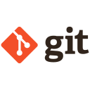

# Портфолио
Привет!!!

👨‍💻 Обо мне :

Начинающий специалист в сфере QA, получивший знания по ручном тестировании веб-приложений на курсе Нетологии. Стремлюсь применить полученные навыки на практике и развиваться в области обеспечения качества ПО.

По образованию радиоинженер.

https://raw.githubusercontent.com/devicons/devicon/670a611ad1c3e057ee385168d65c8ab27a7e1be5/icons/git/git-original-wordmark.svg
